## AR Hotel adalah Website Booking and Management - Laravel Application

## Getting Started

Langkah-Langkah

1. Follow Laravel Installation guide.
2. Pull this repository
3. Create database and link it in the project .env file [Check Online guides for reference]
4. Run migration and seeding command:
   - php artisan migrate
   - php artisan db:seed
5. Run laravel application
   - php artisan server
6. Login User
   6.1. User Credentials:
   Email: admin@gmail.com
   Password: password
   6.2. Admin Credentials:
   Email: admin@gmail.com
   Password: password
7. Database Sudah Saya Sediakan 
dengan nama db_hotel_sql
### Prerequisites

1. Working knowledge of PHP, MySQL & Apache
2. Knowledge of Laravel framework

## Jangan Lupa Follow Github Saya

www.github.com/Arfiyan19

## TAMPILAN

HALAMAN HOME USER
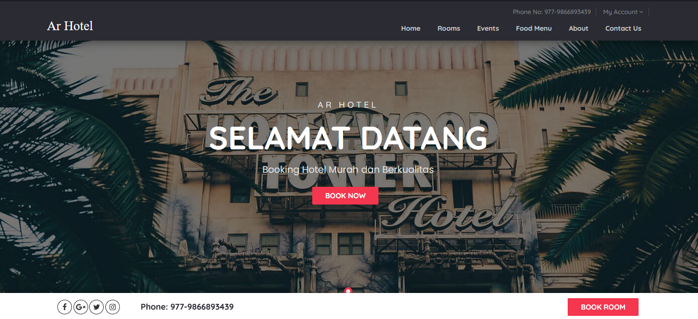
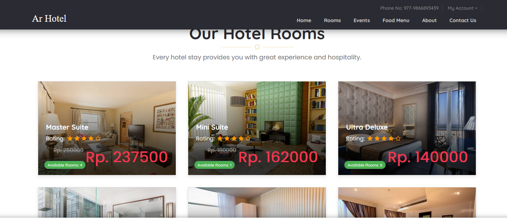
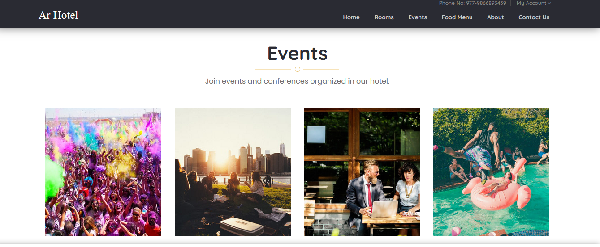
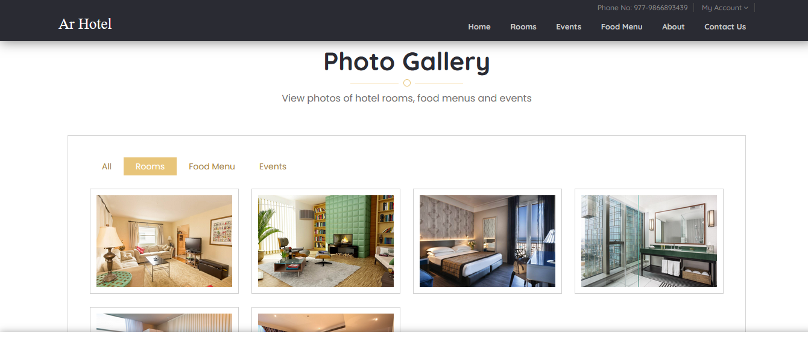  

HALAMAN ROOM HOTEL
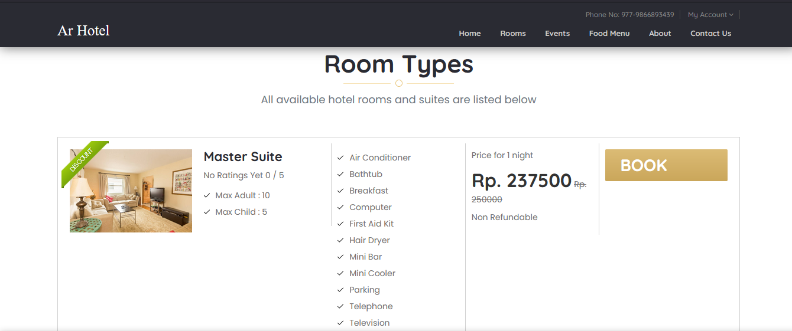  
HALAMAN USER BOOKING
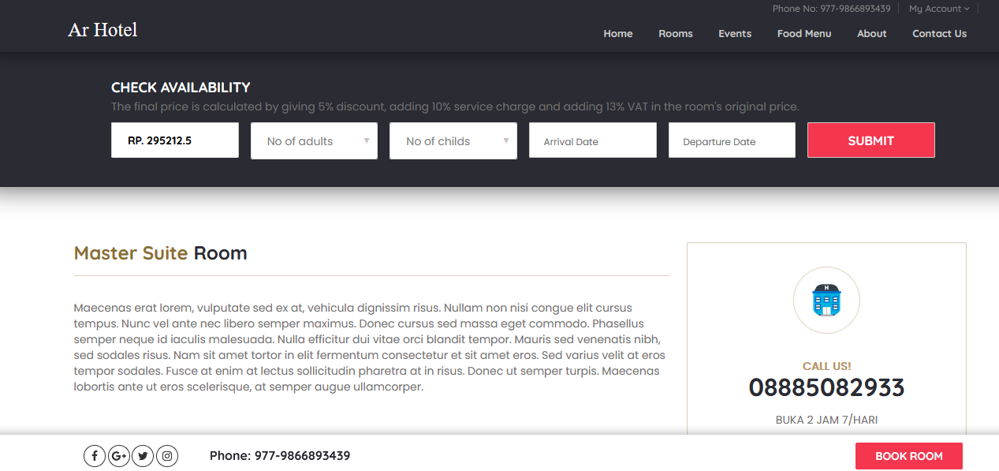  
HALAMAN EVENT
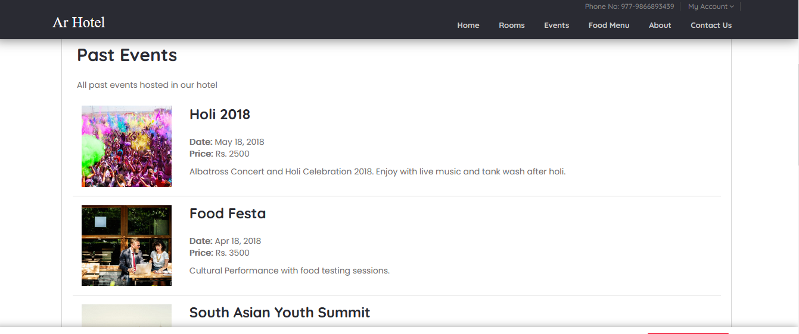  
HALAMAN FOOD DAN MENU MAKANAN
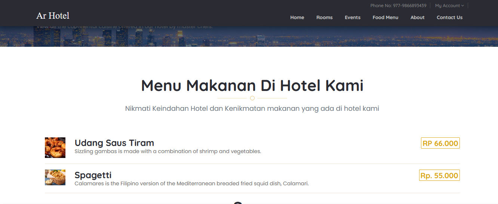  
HALAMAN LOGIN
  
HALAMAN DASHBOARD USER
  
HALAMAN ADMIN BOOKING
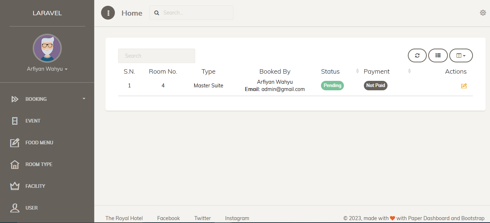  
HALAMAN ADMIN EVENT
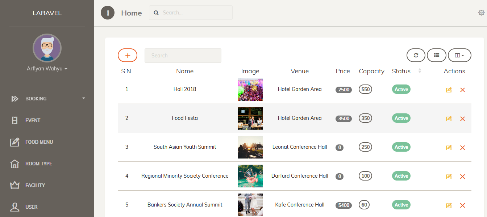  
HALAMAN ADMIN FOOD DAN MENU
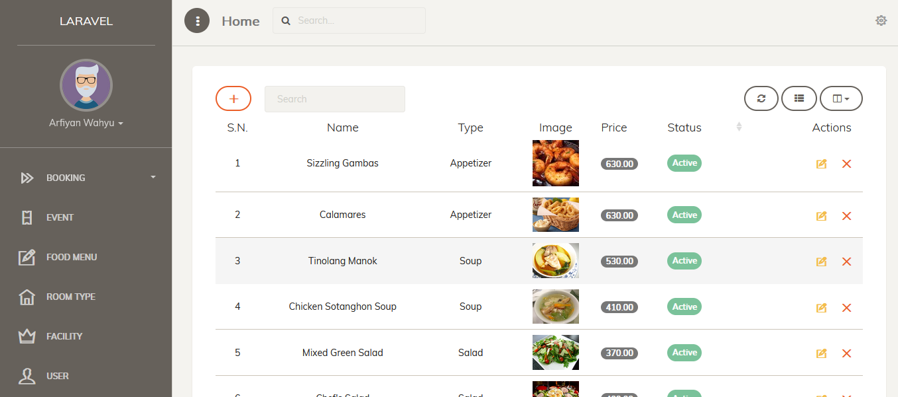  
HALAMAN ADMIN ROOM TYPE
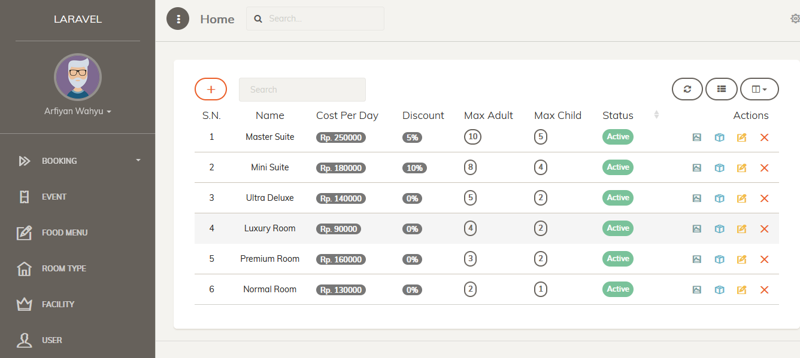  
HALAMAN ADMIN FASILITAS HOTEL
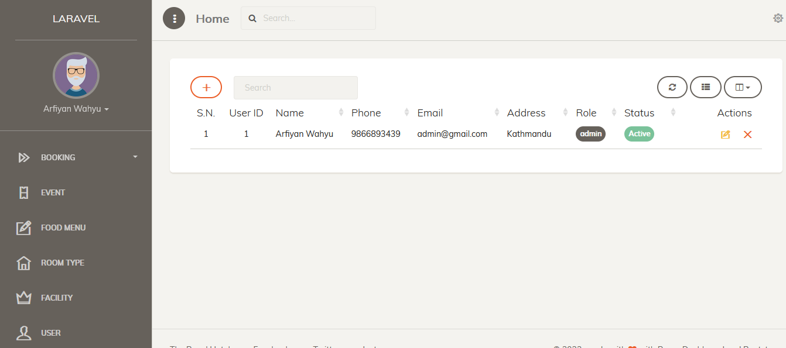  
HALAMAN ADMIN MENU USER
  
